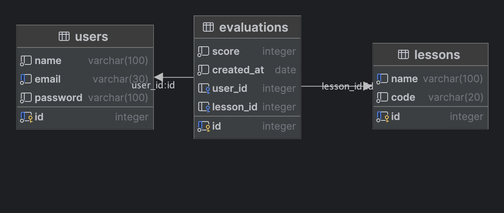

# Сервис для хранения и получения оценок за занятия


### Содержание

1. [Инструкция по запуску](#instruction)
2. [Описание базы данных](#database)
3. [Описание структуры проекта](#structure)


### <a name="instruction"></a> Инструкция по запуску

1. Необходимо склонировать репозиторий с помощью команды `git clone`.
2. Перейти в папку проекта и создать `.env` файл с переменными окружения как в примере [в этом файле](.env.example).
3. Если на вашем компьютере не установлен Docker, то установите его: https://www.docker.com/get-started/
4. Запустите проект с помощью команды `docker-compose up --build`.
5. После успешного запуска проекта, перейдите на http://localhost:8080/docs.
6. Для того, чтобы пользоваться методами API, необходимо авторизоваться. Для этого перейдите на страницу с
   документацией. Создайте пользователя и далее перейдите к методу auth/login, используя данные пользователя, которого
   вы создали. Теперь необходимо ввести Bearer токен в поле `Authorize` в правом верхнем углу страницы Swagger.


### <a name="api"></a> Описание базы данных

Использовалась база данных PostgreSQL. Структура базы данных представлена на следующей диаграмме:



### <a name="structure"></a> Описание структуры проекта

```
.
├── Dockerfile
├── README.md
├── db
│   ├── db.Dockerfile
│   └── init.sql
├── docker-compose.yml
├── nest-cli.json
├── package-lock.json
├── package.json
├── public
│   └── db_diagram.png
├── src
│   ├── app
│   │   └── exceptions
│   │       └── httpExceptionFilter.ts
│   ├── app.controller.spec.ts
│   ├── app.module.ts
│   ├── common
│   │   └── logger.ts
│   ├── config
│   │   └── prod.ts
│   ├── main.ts
│   └── modules
│       ├── auth
│       │   ├── auth.controller.spec.ts
│       │   ├── auth.controller.ts
│       │   ├── auth.guard.ts
│       │   ├── auth.module.ts
│       │   ├── auth.service.spec.ts
│       │   ├── auth.service.ts
│       │   ├── constants.ts
│       │   ├── decorators.ts
│       │   └── dto
│       │       └── sign-in-dto.ts
│       ├── lessons
│       │   ├── dto
│       │   │   ├── create-evaluations.dto.ts
│       │   │   └── create-lesson.dto.ts
│       │   ├── entities
│       │   │   ├── evaluation.entity.ts
│       │   │   └── lesson.entity.ts
│       │   ├── lessons.controller.spec.ts
│       │   ├── lessons.controller.ts
│       │   ├── lessons.module.ts
│       │   ├── lessons.service.spec.ts
│       │   └── lessons.service.ts
│       └── users
│           ├── dto
│           │   ├── create-user.dto.ts
│           │   └── new-user.dto.ts
│           ├── entities
│           │   └── user.entity.ts
│           ├── users.controller.spec.ts
│           ├── users.controller.ts
│           ├── users.module.ts
│           ├── users.service.spec.ts
│           └── users.service.ts
├── tsconfig.build.json
└── tsconfig.json

18 directories, 45 files
```
